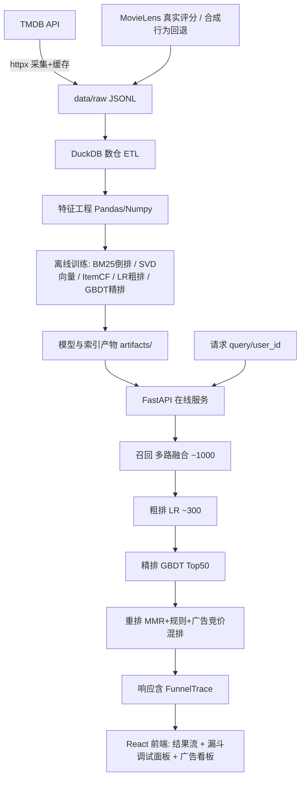

## 产品概述

以 TMDB 为数据源构建一个「搜索 + 推荐 + 广告」一体化排序系统 Demo：实时拉取 TMDB 影片数据，经 DuckDB/Pandas 离线数仓与特征工程处理后训练真实排序模型，在线请求依次经过 **召回 → 粗排 → 精排 → 重排** 四层漏斗，并在重排阶段完成广告竞价混排，最终由 Web 页面展示结果并提供可逐层下钻的漏斗调试面板。

## 核心功能

- **数据采集与大数据处理**：通过 TMDB API 拉取影片元数据、演职员、关键词、相似/推荐影片图，落盘为原始 JSON；用 DuckDB 建仓（影片维表、类型/关键词/演员桥表、Item 相似边表、用户行为事实表、广告维表），Pandas 完成清洗、归一化与特征工程。
- **多路召回**：文本倒排（BM25）、向量召回（SVD 语义/行为 Embedding）、ItemCF（行为共现 + TMDB 相似/推荐图）、热门与规则召回（类型/年代/质量分），多路融合去重后输出千级候选并记录每路命中来源。
- **粗排**：轻量模型（逻辑回归 + 双塔内积 + 贝叶斯质量分）对千级候选快速打分，截断至百级候选。
- **精排**：GBDT 模型预估 pCTR/pCVR 代理分，融合质量与新鲜度多目标打分，输出 Top-N 精排结果及各特征贡献度。
- **重排**：MMR 多样性打散、同系列/同导演窗口去重、探索利用、业务规则（质量门槛、黑名单、新鲜度提权）。
- **广告竞价混排**：广告库（影片宣发内容 + 广告主 bid/日预算/频次上限），eCPM = pCTR × bid × 质量因子排序，GSP 二价扣费，固定广告位插入，会话级频次控制与预算 pacing 扣减，前端以「广告」角标标记。
- **搜索与推荐双场景**：有 query 走搜索漏斗；无 query 走个性化推荐漏斗（用户画像/历史行为触发），共用同一套链路与调试面板。
- **漏斗调试面板**：每次请求返回每一层的候选 id、数量、耗时、分数明细与截断原因，前端以瀑布图 + 表格 + 分数归因条可视化。
- **离线评估**：Recall@K、NDCG@K、CTR AUC/GAUC、广告 eCPM/RPM 与预算消耗，一键脚本出报告。

## 技术栈选型

- **语言/运行时**：Python 3.14.6（本机 Homebrew 已确认），Node 用于前端构建（缺失时回退为纯静态页方案）
- **数据采集**：`httpx`（TMDB API v3，含限流、重试、分页、本地缓存）、`orjson` 落盘 JSONL
- **大数据处理**：**DuckDB + Pandas**（用户指定）— DuckDB 做 SQL 建仓/聚合/Join，Pandas+Numpy 做特征工程；Parquet 作为中间存储
- **算法/模型**：`scipy` 稀疏矩阵（ItemCF 共现、Swing 权重）、`sklearn` `TruncatedSVD`（向量召回）、`TfidfVectorizer`+自实现 BM25 倒排、`LogisticRegression`（粗排）、`HistGradientBoostingClassifier`（精排 GBDT）、Numpy 归一化暴力检索（万级规模毫秒级）
- **服务层**：FastAPI + Uvicorn + Pydantic v2，进程内加载索引与模型，LRU 缓存热点 query
- **前端**：React + TypeScript + Vite + Tailwind CSS + tdesign-react（Table/Tabs/Tag/Slider 等数据面板组件）
- **兼容性约束**：本机 Python 3.14，刻意规避 `lightgbm`/`xgboost`/`faiss`/`implicit` 等可能无 3.14 wheel 的库；GBDT 用 sklearn 内建实现，向量检索用 Numpy 暴力内积（20k×64 约 1.3M FLOPs，<5ms）

## 实现方案

**总体策略**：离线「数仓 + 特征 + 模型 + 索引」产物化，在线「四层漏斗 + 广告混排」服务化，前端「结果 + 漏斗可观测」一体化。

**关键决策与权衡**：

1. **TMDB 无公开用户评分** → 主路径用 TMDB 自有关系图（`/movie/{id}/similar`、`/movie/{id}/recommendations`、关键词/主演/导演共现）构建**真实 Item-Item 相似度**做 i2i 召回；用户行为侧用 **MovieLens ml-latest-small**（`links.csv` 含 `tmdbId`，可与 TMDB 精确对齐）作为真实交互标签，下载失败时回退**固定种子合成行为日志**并在产物与报告中显式标注来源（`data/warehouse/meta.json`）。
2. **Key 缺失可跑通**：`TMDB_API_KEY` 从 `.env` 读取；缺失时采集模块报明确错误并自动加载 `data/seed/*.json` 内置小样例快照，保证 Demo 端到端可运行。
3. **广告标的构造**：以 TMDB 影片作为被推广的「宣发内容」，广告主=片方/流媒体，配置 bid、日预算、频次上限、投放定向（类型/地区/年代）；创意复用影片海报与元信息，扣费采用 GSP 二价。
4. **漏斗可观测性**：统一 `FunnelTrace` 数据结构贯穿四层 + 广告层，记录 stage/candidate_ids/count/latency_ms/scores/cut_reason，随 API 响应返回，供调试面板消费；该 trace 设计为可选（响应开关），不影响线上性能。

**性能与可靠性**：召回层倒排与向量检索均为 O(命中规模)，粗排 LR 千级样本毫秒级，精排 GBDT 百级样本毫秒级，重排 MMR O(N²) 限于 Top50；目标端到端 P95 < 150ms。模型/索引在启动时一次性 mmap 加载，避免每次请求 IO；TMDB 采集带限流与断点续传缓存，避免重复打接口。

## 实现注意事项

- 严格复用 `src/reelrank/` 分层包结构，不在服务层写业务逻辑；配置统一走 `config/settings.yaml` + `.env`。
- 采集层务必限速（TMDB 约 50 req/s 上限）并缓存原始响应到 `data/raw/`，重跑 ETL 不重新打接口。
- DuckDB 连接需显式关闭；ETL 使用 `CREATE OR REPLACE TABLE` 保证幂等重跑。
- 特征与打分口径需统一在 `features/registry.py` 注册，避免粗排/精排特征漂移。
- 日志使用标准 `logging`，记录各层候选量与耗时（INFO 一行/请求），禁止打印完整候选列表与用户隐私；广告预算扣减需落盘而非仅内存，避免重启丢失。
- 保持向后兼容：新增能力走配置开关（如 `ads.enabled`、`funnel.trace`），不做无关重构。

## 架构设计



## 目录结构

```
reelrank_demo01/
├── README.md                      # [NEW] 一键启动、架构说明、算法口径与数据来源标注
├── requirements.txt               # [NEW] 锁定 duckdb/pandas/numpy/scipy/scikit-learn/fastapi/uvicorn/httpx/pydantic/orjson
├── .env.example                   # [NEW] TMDB_API_KEY 等配置模板
├── config/settings.yaml           # [NEW] 采集参数、漏斗各层截断数、广告策略、特征开关
├── scripts/
│   ├── run_pipeline.sh            # [NEW] 一键 拉取→ETL→特征→训练→产物落盘
│   └── run_eval.py                # [NEW] 离线评估，输出 Recall@K/NDCG@K/AUC 与漏斗耗时报告
├── src/reelrank/
│   ├── config.py                  # [NEW] 加载 settings.yaml 与 .env，全局配置对象
│   ├── data/tmdb_client.py        # [NEW] TMDB API 客户端：限流、重试、分页、缓存
│   ├── data/fetch_tmdb.py         # [NEW] 拉取 popular/discover/search + credits/keywords/similar/recommendations
│   ├── data/behavior_source.py    # [NEW] MovieLens(links.csv 对齐 tmdbId) 真实行为，失败回退合成日志并标注
│   ├── warehouse/schema.sql       # [NEW] DuckDB 建表 DDL（dim_movie/bridge_*/item_sim_edge/fact_user_event/dim_ad/fact_ad_delivery）
│   ├── warehouse/etl.py           # [NEW] 原始 JSON → Parquet → DuckDB 幂等 ETL
│   ├── features/registry.py       # [NEW] 特征注册与统一取数口径
│   ├── features/item_features.py  # [NEW] 影片特征：贝叶斯质量分、新鲜度、热度、类型/关键词向量
│   ├── features/user_features.py  # [NEW] 用户画像：类型偏好、年代偏好、演员偏好、活跃度
│   ├── models/bm25_index.py       # [NEW] 倒排索引与 BM25 检索
│   ├── models/vector_index.py     # [NEW] TruncatedSVD 向量 + Numpy 暴力 ANN
│   ├── models/item_cf.py          # [NEW] ItemCF/Swing 共现与 TMDB 相似图融合
│   ├── models/coarse_ranker.py    # [NEW] 粗排 LR + 双塔内积 + 质量分融合
│   ├── models/fine_ranker.py      # [NEW] 精排 HistGradientBoostingClassifier 多目标 pCTR
│   ├── train/train_offline.py     # [NEW] 训练全部模型与索引，落盘 artifacts/
│   ├── recall/multi_recall.py     # [NEW] 多路召回融合、去重、来源标记
│   ├── rank/coarse.py             # [NEW] 粗排阶段封装（打分+截断+trace）
│   ├── rank/fine.py               # [NEW] 精排阶段封装（GBDT 打分+特征归因）
│   ├── rank/rerank.py             # [NEW] MMR 打散、窗口去重、探索、规则过滤
│   ├── ads/ad_index.py            # [NEW] 广告库加载与定向检索（bid/预算/频次）
│   ├── ads/bidding.py             # [NEW] eCPM=pCTR×bid×质量因子，GSP 二价扣费、预算扣减
│   ├── ads/mixer.py               # [NEW] 广告位插入与自然结果混排
│   ├── serving/api.py             # [NEW] FastAPI 路由：search/recommend/debug/ads/health
│   ├── serving/schemas.py         # [NEW] Pydantic 请求响应模型，含 FunnelTrace
│   ├── serving/funnel.py          # [NEW] 编排四层漏斗 + 广告层，产出完整 trace
│   ├── serving/state.py           # [NEW] 进程内索引/模型/广告状态加载与 LRU 缓存
│   ├── eval/metrics.py            # [NEW] Recall@K、NDCG@K、AUC/GAUC、RPM/eCPM
│   └── eval/offline_eval.py       # [NEW] 离线评测与报告生成
├── web/
│   ├── index.html / vite.config.ts  # [NEW] 前端工程入口
│   ├── src/App.tsx                # [NEW] 路由与整体布局
│   ├── src/pages/SearchPage.tsx   # [NEW] 搜索结果页（含广告角标）
│   ├── src/pages/RecommendPage.tsx# [NEW] 个性化推荐页
│   ├── src/pages/FunnelPage.tsx   # [NEW] 漏斗调试面板（瀑布图+候选表+分数归因）
│   ├── src/pages/AdsPage.tsx      # [NEW] 广告投放看板（eCPM/扣费/预算消耗）
│   ├── src/components/*.tsx       # [NEW] MovieCard、FunnelWaterfall、ScoreBreakdown、StageTable 等
│   └── src/api/client.ts          # [NEW] 后端 API 封装
├── data/                          # [NEW] raw/(缓存) warehouse/(duckdb+parquet) seed/(内置样例)
├── artifacts/                     # [NEW] 模型与索引产物（npz/joblib/parquet）
└── tests/                         # [NEW] 关键模块单测（BM25、漏斗截断、eCPM 排序、预算扣减）
```

## 关键代码结构

```python
# src/reelrank/serving/schemas.py
class StageTrace(BaseModel):
    stage: Literal["recall", "coarse", "fine", "rerank", "ads"]
    input_count: int
    output_count: int
    latency_ms: float
    cut_reason: str
    items: list[CandidateItem]      # 候选 id + 各分数分量（bm25/vector/itemcf/coarse/fine/ecpm）
    sources: dict[str, int]         # 召回各路命中数量

class FunnelTrace(BaseModel):
    request_id: str
    scene: Literal["search", "recommend"]
    stages: list[StageTrace]
    total_latency_ms: float
    ads: list[AdItem]               # 含 ecpm、bid、price(GSP)、slot、advertiser

# src/reelrank/ads/bidding.py
def compute_ecpm(pctr: float, bid: float, quality_factor: float) -> float: ...
def gsp_price(sorted_ecpm: list[float], bid: list[float], idx: int) -> float: ...
```

## 应用类型

Web 桌面端（数据密集型控制台 + 内容消费界面），面向算法/工程视角的演示与调试。

## 设计风格

深色影院质感 + 玻璃拟态 + 数据可视化。深色底衬托影片海报，金色高光强化「影院/榜单」氛围，玻璃拟态面板承载漏斗与广告数据，候选卡片带悬停微动效（微缩放 + 高光扫过），漏斗瀑布图用渐变条表现逐层收敛，页面切换与结果加载使用骨架屏与渐入动画。

## 页面规划（4 页）

1. **搜索页**：顶部全局导航栏（Logo / 搜索框 / 场景切换 / 用户切换）→ 左侧筛选区（类型、年代、评分、是否含广告）→ 中部结果瀑布卡片流（海报、评分、年份、类型标签、广告角标、相关度分数条）→ 右侧「本次请求漏斗概览」迷你瀑布图 → 底部状态栏（召回量/耗时/模型版本）。
2. **推荐页**：顶部导航 → 用户画像卡（类型偏好分布环图、近期行为）→ 个性化推荐流（分栏目：因为你看过 / 相似影片 / 探索发现）→ 右侧漏斗概览迷你图 → 底部状态栏。
3. **漏斗调试面板**（核心页）：顶部导航 + 请求参数区（query/用户/各层截断数滑块/开关广告）→ 四层 + 广告层横向瀑布图（宽度=候选量，颜色=阶段）→ 阶段 Tab（召回各路来源分布条 / 粗排分数 / 精排特征归因 / 重排前后位次对比箭头）→ 候选明细表（id、标题、各阶段分数、升降位、截断原因）→ 底部各层耗时条形图。
4. **广告投放看板**：顶部导航 → 指标卡组（曝光、点击、eCPM、RPM、预算消耗率）→ 广告主列表（bid、日预算、已消耗、频次上限、状态）→ 本次混排结果表（广告位次、pCTR、eCPM、二价扣费）→ 预算消耗趋势折线图。

## 交互要点

- 搜索输入即时联想，回车后结果以渐入动画呈现；卡片悬停显示「为什么推荐我」（召回来源 + 分数归因）。
- 漏斗面板支持逐层点击下钻：点击某阶段即刷新下方明细表，位次变化用上升/下降箭头动画标注。
- 广告位卡片常驻「广告」角标与「广告主」署名，悬停展示 eCPM 计算分解（pCTR × bid × 质量因子）。
- 响应式：≥1440px 三栏布局，1024–1440px 折叠右栏为抽屉，表格横向滚动。

## Agent Extensions

### Skill

- **playwright-cli**
- 用途：在本地启动 FastAPI + 前端后做浏览器冒烟验证，确认搜索/推荐结果渲染、广告角标、漏斗调试面板逐层下钻与瀑布图正常展示。
- 预期结果：拿到可回看的页面截图与无控制台报错的验证结论，确认 Demo 端到端可用。

### Integration

- **cloudStudio**（status: connected）
- 用途：在用户确认需要对外访问时，将已本地验证通过的前端产物按 CloudStudio 规则部署。
- 预期结果：产出可访问的项目 URL，且部署内容与本地预览验证内容一致。